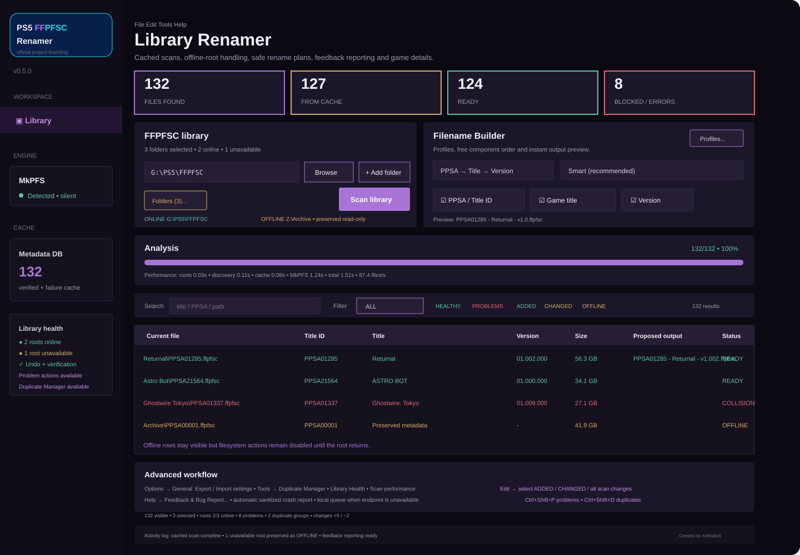

# PS5 FFPFSC Renamer

<p align="center">
  
</p>

Windows desktop utility for scanning PS5 `.ffpfsc` libraries, reading internal metadata, previewing rename plans and applying file/folder renames without rewriting or recompressing the FFPFSC payload.

**Current stable release:** `v0.5.0`  
**Previous stable release:** `v0.4.1`

> [!IMPORTANT]
> **First-use recommendation:** before processing a complete library, validate the workflow with a single `.ffpfsc` file that is non-critical or backed up independently. Keep an external backup of original files whenever practical. The application includes collision checks, pre-flight validation, transactional rollback, post-rename verification and Undo support, but no software can eliminate every risk associated with filesystem errors, storage-device faults, permission issues, unexpected interruptions or third-party tooling. Use of the application and responsibility for user files remain with the user. To the extent permitted by applicable law, the project and its contributors are not liable for loss, corruption or unavailability of user data resulting from use or misuse of the software.

## Preview

<p align="center">
  
</p>

The preview is versioned with the source tree and is a required part of visible desktop changes. Any material UI/layout/branding change must update `docs/screenshots/app-preview.svg` in the same PR/commit; CI blocks stale previews. See [`docs/SCREENSHOT_POLICY.md`](docs/SCREENSHOT_POLICY.md).

## Core capabilities

- Multi-root `.ffpfsc` library scanning with optional recursive traversal.
- Automatic scan of saved library roots at startup.
- Persistent SQLite metadata and failure caches.
- Selective low-memory MkPFS access to internal `sce_sys/param.json` metadata.
- On-demand `icon0.png` and formatted `param.json` display.
- Configurable PPSA / title / version filename builder.
- Reusable naming profiles and custom separators.
- User-facing library organization modes: **One folder per game**, **All files in library root**, and **Keep current structure**.
- Safe empty-source-folder cleanup for flat-root organization, only after successful file moves.
- Search, status filters, duplicate detection, sorting and multi-selection.
- Transactional batch rename with rollback and persistent Undo history.
- Fresh pre-flight validation immediately before filesystem changes.
- Post-rename filesystem identity verification.
- Recycle Bin integration for delete operations.
- Integrated progress display, Activity Log and bounded-memory silent MkPFS helper execution.

## v0.5.0 highlights

The v0.5.0 release adds a non-versioned desktop architecture and extends library workflow tooling:

- canonical `desktop.py` / `desktop_core.py` runtime path;
- legacy `gui_vXX` modules retained only for compatibility;
- compact tabbed **Library setup / Rename builder** configuration so the results table remains the dominant workspace;
- native **File / Edit / Tools / Help** menu kept attached and functional on Windows;
- separated status/footer area with the project credit kept away from the file list;
- user-facing library organization cards with real Before/After guidance;
- modern dark **Review changes** confirmation before filesystem mutation;
- combined metadata/failure cache lookup with one filesystem-stat pass;
- recursive root de-duplication for overlapping library roots;
- scan snapshot comparison with `ADDED`, `REMOVED` and `CHANGED` tracking;
- `ADDED`, `CHANGED`, `HEALTHY`, `PROBLEMS` and `OFFLINE` result filters;
- direct Edit-menu selection for `ADDED`, `CHANGED` and combined added/changed rows;
- compact status summary for visible/selected rows, online roots, problems, duplicate groups and scan changes;
- scan-performance timing plus JSON/CSV export for root checks, discovery, cache and MkPFS phases;
- explicit online/offline root state for removable drives and network locations;
- read-only preservation of previous results for unavailable roots without adding stale rows to rename plans;
- rename-plan manifest export in CSV or JSON before filesystem changes;
- portable application-settings backup and defensive restore under **Options → General**;
- Library Health report actions for problem/duplicate filtering, root management and targeted PARTIAL/ERROR re-analysis;
- Duplicate Manager with in-memory group summaries, explicit sampled comparison and exact Title ID focused selection;
- direct selection shortcuts for all problem rows and all duplicate rows;
- CSV/JSON library exports include scan change state;
- in-app feedback, feature requests and privacy-aware bug/crash reporting;
- official project branding for the Windows executable, taskbar/window icon, sidebar, About dialog and README.

## Feedback, feature requests and bug reports

Use **Help → Feedback & Bug Report...** to report a bug, request a feature, send a suggestion or provide general feedback without preparing an email or manually collecting diagnostics.

The application can attach a sanitized technical report containing the application version, Windows/Python information, root-state counts, library-status counts, last-scan metrics and recent Activity Log lines. Unexpected Tk callback errors are automatically captured into the local feedback queue and the user is invited to review/send the report.

The report does **not** include FFPFSC payload contents, credentials or metadata-cache contents. Configured library paths, common user-profile locations and usernames are redacted before the report is saved or submitted. **Preview technical data** shows the exact JSON payload before submission, and diagnostics can be disabled for manually created feedback.

**Send report** always writes an atomic local copy first. When the release is configured with the project HTTPS feedback receiver, the same button submits the report directly in the background; after a successful response the queued copy is removed. If the network or receiver is unavailable, the report remains safely queued under App Data and no scan, rename or other application workflow is blocked.

## Windows package

Extract the complete release archive and keep both executables in the same directory:

```text
PS5-FFPFSC-Renamer.exe
mkpfs-helper.exe
```

The standalone Windows package does not require Python, a virtual environment or source files.

## Scan workflow

1. Select a library directory with **Browse**.
2. Add additional roots with **+ Add folder** when required.
3. Start or refresh the scan with **Scan library / F5**.
4. Review Title ID, title, version, size, proposed output and status.
5. Open **Rename builder** and choose a naming profile plus the desired final library organization.
6. Review `READY`, blocked, unchanged and preserved `OFFLINE` rows.
7. Optionally export a rename manifest before applying changes.
8. Apply the rename plan and review the final dark confirmation dialog.
9. Use **Ctrl+Z** when the latest completed rename transaction must be restored.

Selected library roots are protected from folder rename/removal. `OFFLINE` rows are informational/read-only and never enter the generated rename plan until their root is available and scanned successfully again.

## Metadata handling

Verified automatic rename metadata is read from internal FFPFSC data through MkPFS. The primary metadata source is:

```text
sce_sys/param.json
```

Game Details can selectively request:

```text
sce_sys/param.json
sce_sys/icon0.png
```

The complete game image is not extracted for these operations.

If MkPFS cannot verify metadata but a PPSA can be inferred safely from the path, the row is marked `PARTIAL`. Partial metadata is display-only and is not eligible for automatic rename.

## Result statuses and filters

Primary statuses:

```text
READY
UNCHANGED
PARTIAL
COLLISION
INVALID
ERROR
OFFLINE
```

Additional filters:

```text
ALL
DUPLICATES
ADDED
CHANGED
HEALTHY
PROBLEMS
OFFLINE
```

`HEALTHY` includes `READY` and `UNCHANGED`. `PROBLEMS` includes `PARTIAL`, `COLLISION`, `INVALID` and `ERROR`. `OFFLINE` identifies metadata preserved from a configured library root that could not be reached during the current scan; filesystem actions remain disabled for those rows.

Duplicate Manager groups current rows by normalized Title ID and summarizes versions, known sizes and statuses from data already in memory. **Compare group** is the only Duplicate Manager action that requests the existing lightweight sampled fingerprint check. **Show group in library** selects only rows with the exact normalized Title ID. The manager does not rename or delete files.

## Filename Builder

Supported components:

```text
PPSA / Title ID
Game title
Version
```

Example outputs:

```text
PPSA01285.ffpfsc
PPSA01285 - Returnal.ffpfsc
Returnal - PPSA01285.ffpfsc
PPSA01285 - Returnal - v1.0.ffpfsc
Returnal - v1.0 - PPSA01285.ffpfsc
```

Built-in naming profiles include:

- ShadowMount / PPSA only
- PPSA + Title
- Title + PPSA
- Full archive
- Title + Version + PPSA

Version compaction examples:

```text
01.000.000 -> 1.0
02.500.000 -> 2.5
01.005.000 -> 1.005
```

Changing naming settings rebuilds the plan from metadata already in memory and does not rescan FFPFSC payloads.

## Library organization

The organization selector describes the desired **final layout**, not an internal implementation mode.

### One folder per game

Every READY `.ffpfsc` ends in one dedicated game folder directly under its selected library root. Folder and file use the generated naming stem. A safe existing dedicated game folder may be renamed instead of recreated so unrelated companion files remain with that game.

Example:

```text
G:\PS5\FFPFSC\
└── PPSA01285 - Returnal - v1.0\
    └── PPSA01285 - Returnal - v1.0.ffpfsc
```

### All files in library root

Every READY `.ffpfsc` is renamed and moved directly into its selected library root.

The safety order is fixed:

1. validate all source/destination paths;
2. rename/move the `.ffpfsc` into the library root;
3. only after that move succeeds, check the old source directory;
4. remove the old directory with a non-recursive empty-directory operation;
5. continue upward through now-empty source ancestors, stopping before the selected library root.

A folder containing **any** other file, hidden file or subfolder is left untouched. The program never recursively deletes a source folder to flatten the library, and it never deletes the selected library root.

Example:

```text
Before
G:\PS5\FFPFSC\Returnal\game.ffpfsc

After
G:\PS5\FFPFSC\PPSA01285 - Returnal - v1.0.ffpfsc
```

If `G:\PS5\FFPFSC\Returnal\` becomes empty after the successful move, it is removed. If it still contains `notes.txt` or any other content, it remains.

### Keep current structure

Only the `.ffpfsc` filename changes. The file stays in its current directory and no folder is created, moved, renamed or removed.

## Rename safety

Rename operations use multiple independent safeguards.

### Pre-flight

Immediately before applying a generated rename plan, source and destination paths are validated again. Destinations created after the original preview are detected before filesystem mutation.

For **All files in library root**, the confirmation also reports how many source directories are candidates for the post-move empty-folder check.

### Transaction rollback

Batch operations track completed steps. If a later step fails, completed steps are rolled back when safe. Flat-root cleanup directories are recreated before affected files are restored to their original paths.

Incomplete rollback is reported explicitly.

### Post-rename verification

Generated renames verify that the destination represents the same filesystem object when supported by the platform. Verification uses file size plus filesystem device/file identity, with sampled fingerprint fallback when required.

Complete multi-gigabyte images are not hashed for routine rename verification.

### Operation History / Undo

Successful rename transactions are persisted in SQLite. Undo refuses to overwrite newly occupied original paths, removes application-created directories only when empty, and recreates source folders removed by safe flat-root cleanup before restoring their files. The UI advertises `Ctrl+Z` only when the completed transaction was actually recorded successfully.

### Rename Safety Self-Test

`Tools → Rename safety self-test...` executes real rename operations only against disposable temporary `.ffpfsc` files. Coverage includes file-only/keep-structure rename, per-game-folder operations, flat-root cleanup, collisions, rollback and Undo. Temporary payloads are compared before and after the test sequence.

## Library change tracking

The v0.5 scan snapshot records path, size and modification timestamp in App Data. Each completed scan can report:

```text
ADDED
REMOVED
CHANGED
```

Snapshot comparison reuses filesystem state collected during cache processing and does not require a second MkPFS pass. Temporarily unavailable roots preserve their last verified baseline so disconnection is not misreported as removal/change.

Rename operations performed by the application migrate the snapshot state to the new path to avoid false add/remove events on the following scan.

The Edit menu can focus/select `ADDED`, `CHANGED` or both from the already loaded scan results. These commands do not rescan files and do not invoke MkPFS.

## Library roots and Live Watch

Saved roots remain configured when removable drives or network locations are temporarily unavailable. Root state is reported as `ONLINE`, `OFFLINE`, `ERROR` or `UNKNOWN`.

A failed or cancelled scan restores the previous successful library view as stale/read-only context. During a partially successful multi-root scan, previous rows belonging only to unavailable roots are preserved as `OFFLINE`; they are excluded from generated rename plans and guarded from automatic details/diagnostics/re-analysis/duplicate-comparison filesystem access until a successful scan refreshes them.

Optional automatic cache pruning is conservative: it runs in the background only when every configured library root is confirmed online and checks stale cache records only inside the currently configured roots. Historical/disconnected-root cache entries are left untouched by automatic pruning. Global pruning remains an explicit Cache Manager action.

Live Library Watch is optional and disabled by default. Supported intervals:

```text
15 / 30 / 60 / 120 seconds
```

The watcher checks path, size and modification time only. MkPFS is started only after a real change triggers a normal cached scan.

## Performance

Repeat-scan performance relies on:

- combined verified/failure cache lookup;
- one filesystem-stat pass reused by cache, size display and scan snapshots;
- SQLite batch reads;
- iterative `os.scandir()` discovery;
- overlapping recursive-root collapse;
- filesystem-free lexical root identity and relative-path rendering for table/status updates;
- no directory symlink/reparse traversal;
- negative caching of unchanged MkPFS failures;
- configurable metadata workers;
- bounded-memory MkPFS helper paths for release metadata/details;
- on-demand artwork/JSON extraction;
- details-cache migration after Rename and Undo;
- aggregate scan-performance report export without rescanning or file-level report I/O.

Worker presets:

- `1 (HDD / safest)`
- `2`
- `4 (SSD / NVMe)`
- `Auto`

GPU acceleration is not used because the metadata workload is primarily storage-bound.

## Exports and maintenance

Available exports:

- full library CSV/JSON;
- visible/filtered results CSV/JSON;
- rename-plan manifest CSV/JSON;
- last completed scan performance CSV/JSON;
- portable settings backup JSON.

The rename manifest records source, destination, Title ID, title, version, status, reason and directory-operation information before any filesystem change is applied.

Settings backup/restore affects application preferences only. Import validates backup format, schema and configuration field types before replacing current settings. Metadata cache, Game Details cache, operation history, activity log and FFPFSC files are not included in the backup payload. Restore does not start a rename and does not trigger an automatic library scan.

## Tools and shortcuts

Desktop menus provide scan, export, Undo, focused selection, Options, History, Library Health, Library Statistics, Duplicate Manager, scan-performance export, scan-change reporting, cache maintenance, MkPFS configuration, diagnostics, safety self-test and **Feedback & Bug Report** functions. Settings backup/restore is available under **Options → General**.

Keyboard shortcuts:

```text
F5             Scan library
Ctrl+Z         Undo last rename
Ctrl+A         Select all visible results
Ctrl+E         Export library CSV
Ctrl+Shift+P   Select all problem rows
Ctrl+Shift+D   Select all duplicate rows
```

`Ctrl+Z` and `Ctrl+A` preserve normal text-editing behavior when focus is inside Entry/Text/Combobox/Spinbox controls rather than the library table.

## Local application data

```text
%LOCALAPPDATA%\PS5-FFPFSC-Renamer\settings.json
%LOCALAPPDATA%\PS5-FFPFSC-Renamer\metadata-cache.sqlite3
%LOCALAPPDATA%\PS5-FFPFSC-Renamer\operation-history.sqlite3
%LOCALAPPDATA%\PS5-FFPFSC-Renamer\naming-profiles.json
%LOCALAPPDATA%\PS5-FFPFSC-Renamer\scan-snapshot.json
%LOCALAPPDATA%\PS5-FFPFSC-Renamer\details-cache\
%LOCALAPPDATA%\PS5-FFPFSC-Renamer\feedback-queue\
%LOCALAPPDATA%\PS5-FFPFSC-Renamer\activity.log
```

Cache-clear operations do not remove saved library roots or application settings unless the corresponding settings action is selected explicitly.

## Legal and responsible use

PS5 FFPFSC Renamer is intended for lawful homebrew use and personally created backups of lawfully owned content.

The project does not download games, provide encryption/license keys, bypass DRM or license checks, distribute copyrighted PlayStation files, or include firmware, exploits or payloads.

Use is subject to applicable laws and license terms. PS5 FFPFSC Renamer is an independent project and is not affiliated with, sponsored by or endorsed by Sony Interactive Entertainment.

## Credits and acknowledgements

Third-party components and related projects are listed according to their actual role in the project.

### Runtime dependencies

- **[MkPFS — PSBrew/MkPFS](https://github.com/PSBrew/MkPFS)** — PFS/PFSC inspection and selective extraction engine. Tested package dependency: `mkpfs==0.0.9`. MkPFS is separately licensed under GPL-3.0.
- **[Send2Trash](https://github.com/arsenetar/send2trash)** — operating-system Recycle Bin integration.

### Build and packaging

- **[PyInstaller](https://github.com/pyinstaller/pyinstaller)** — standalone Windows executable packaging.

### Related projects and workflow references

- **[PS5 exFAT Image Builder — kerrdec97/ps5-exfat-builder](https://github.com/kerrdec97/ps5-exfat-builder)** — desktop library-workflow reference.
- **[PS5 FFPFSC PRO — KINGDKAK/PS5-FFPFSC-PRO](https://github.com/KINGDKAK/PS5-FFPFSC-PRO)** — related compression utility and progress/log workflow reference.
- **[PS5 FFPFS CLI — bizkut/ps5-ffpfs-cli](https://github.com/bizkut/ps5-ffpfs-cli)** — related CLI and Title ID naming workflow reference.

These references do not imply source-code ownership, affiliation or endorsement. Exact licensing and redistribution information is maintained in [`THIRD_PARTY_NOTICES.md`](THIRD_PARTY_NOTICES.md).

## Development

Source-development launcher:

```text
tools\dev\RUN_DEV.bat
```

Manual environment:

```powershell
py -3.11 -m venv .venv
.\.venv\Scripts\Activate.ps1
python -m pip install -e ".[dev]" "mkpfs==0.0.9"
pytest -q
ps5-ffpfsc-renamer-gui
```

GitHub Actions compiles the source tree, enforces README preview freshness for all visible desktop paths, runs automated tests and builds the standalone Windows package. The official project symbol is the source for generated Windows `.png`/`.ico` artwork so CI cannot silently fall back to legacy placeholder artwork.

## License

PS5 FFPFSC Renamer is licensed under the MIT License. See [`LICENSE`](LICENSE).

MkPFS remains separately licensed under GPL-3.0. See [`THIRD_PARTY_NOTICES.md`](THIRD_PARTY_NOTICES.md) and the source archive distributed with Windows releases.
